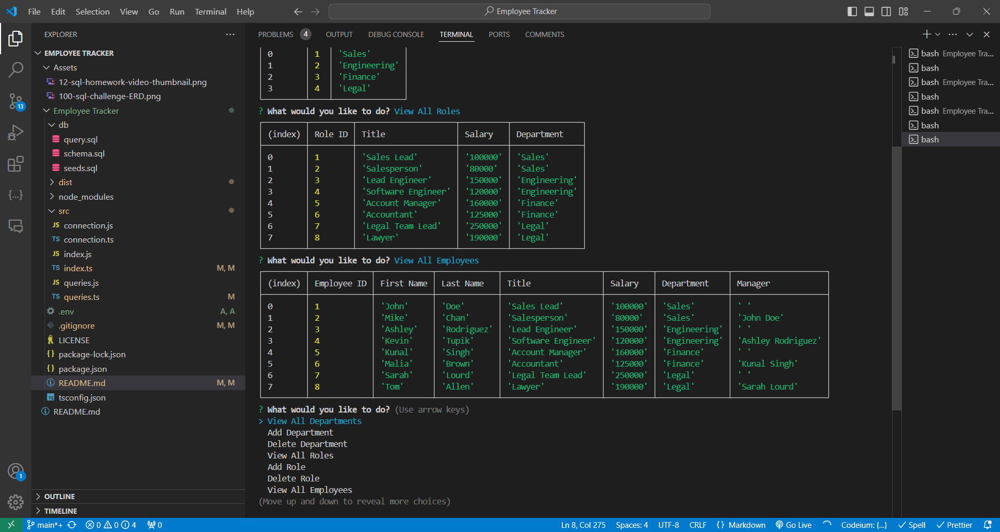

# Employee Tracker

## Introduction

Welcome to Employee Tracker!

This project is designed to help business owners and managers efficiently view and manage employee information through a command-line interface. The Employee Tracker allows users to interact with a company's employee database by viewing, adding, updating, and deleting employee records, departments, and roles.

Watch the video below for a quick overview and demo of the project:

https://drive.google.com/file/d/1VY9Po9H4JHbiBqo2l9NSJ67scy9An9Kh/view?usp=drive_link

## Description

The Employee Tracker project provides a Content Management System (CMS) that enables non-developers to easily view and interact with employee information stored in a database. It categorizes employee data by department, role, and individual employee, making it easier to manage and organize workforce information.

This project addresses the challenge of efficiently managing employee data by enhancing data accessibility, ensuring consistency, and streamlining HR processes. It is a tool for business owners and managers who need to organize and plan their workforce effectively.

Throughout this project, I gained experience in creating schemas, seeds, and query files using PostgreSQL, developing functions with pooled queries, and displaying and storing database information through a Command Line Interface (CLI).

## Table of Contents

- [Installation](#installation)
- [Usage](#usage)
- [License](#license)
- [Contributing](#contributing)
- [Tests](#tests)
- [Questions](#questions)

## Installation

1. Clone the repository: `git clone [repository-url]`
2. Navigate to the project directory: `cd employee-tracker`
3. Install dependencies: `npm install`
4. Set up the database: Copy and paste the SQL code from `schema.sql` into the CLI.
5. Configure environment variables: Update the information in the `.env` file, as required.
6. Run application: `npm run start`

## Usage

1. Start the application: `npm run start`
2. Navigate through the CLI menu and press ‘Enter’ to select an option.
3. Perform operations:
   - View departments, roles, or employees
   - Add a department, role, or employee
   - Update an employee role or employee manager
   - View employees by manager or by department
   - Delete a department, role, or employee
   - View the total budget
4. Exit the application.

## License

This project is licensed under the MIT license.

## Contributing

- Author: [Rory Dowse](https://github.com/RoryDowse)
- Third-party assets:
  - [pg Package](https://www.npmjs.com/package/pg)
  - [Inquirer Package](https://www.npmjs.com/package/inquirer/v/8.2.4)
  - [Native "async/await" Keywords](https://node-postgres.com/guides/async-express)
- Acknowledgments: I would like to thank EdX TA James Harding for his guidance during the development of this project.

## Tests

### Examples for Testing the Employee Tracker Project

#### Viewing All Employees

1. Select "View All Employees":
   - From the main menu, choose the option to view all employees.
2. Verify Employee List:
   - Check that the list includes correct details for each employee, including their ID, first name, last name, job title, department, salary, and manager. For example, ensure that all current employees are displayed with accurate information.

#### Adding a Department

1. Select "Add Department":
   - From the main menu, choose the option to add a new department.
2. Input Department Details:
   - Enter a unique department name, such as "Human Resources".
3. Verify the Department:
   - After adding, select "View All Departments" from the menu. Confirm that the "Human Resources" department appears in the list with the correct department ID.

#### Updating an Employee Role

1. Select "Update Employee Role":
   - From the main menu, choose the option to update an employee's role.
2. Input Update Details:
   - Enter the ID of the employee to update (e.g., "3"). Then, select a new role for the employee (e.g., "Senior Developer").
3. Verify the Update:
   - After updating, select "View All Employees" from the menu. Confirm that the employee’s role has been updated to "Senior Developer".

#### Deleting a Role

1. Select "Delete Role":
   - From the main menu, choose the option to delete a role.
2. Input Role Details:
   - Enter the ID of the role to delete (e.g., "5").
3. Verify the Deletion:
   - After deleting, select "View All Roles" from the menu. Ensure that the deleted role no longer appears in the list.

## Questions

Please visit my GitHub profile: [Rory Dowse](https://github.com/RoryDowse)  
For additional questions, please contact me at: rorydowse@hotmail.com
